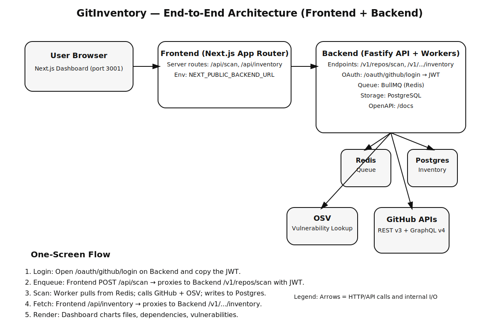

# GitInventory Architecture

## Overview

GitInventory is a comprehensive GitHub repository inventory system designed with a modern microservices architecture. The system consists of a Next.js frontend dashboard and a Fastify-based backend API, with supporting infrastructure for data storage, caching, and background processing.

## System Architecture

## System Flow

```mermaid
flowchart LR
  User["👩‍💻 User Browser<br/>Next.js Dashboard (3001)"] 
    --> FE["Frontend (Next.js App Router)<br/>/api/scan, /api/inventory"]

  FE --> BE["Backend (Fastify API + Workers)<br/>/v1/repos/scan, /v1/.../inventory<br/>/oauth/github/login → JWT<br/>BullMQ + Redis, Postgres"]

  BE -->|Queue| Redis[(Redis Queue)]
  BE -->|Store| Postgres[(Postgres DB)]
  BE -->|Scan repos| GitHub["GitHub APIs<br/>REST v3 + GraphQL v4"]
  BE -->|Vulns| OSV["OSV API<br/>Vulnerability Lookup"]

  classDef service fill:#fff,stroke:#111,stroke-width:2px,rx:12
  classDef infra fill:#f6f6f6,stroke:#111,stroke-width:1.5px,rx:10

  class User,FE,BE service
  class Redis,Postgres,GitHub,OSV infra
```

## Component Overview

### Frontend (Next.js App Router)
- **Port**: 3001
- **Technology**: Next.js 14 with App Router, React 18, TypeScript, Tailwind CSS
- **Key Features**:
  - Server-side API routes for proxying backend calls
  - Real-time dashboard with charts and metrics
  - GitHub OAuth integration
  - Responsive design with modern UI components

### Backend (Fastify API + Workers)
- **Port**: 3000
- **Technology**: Node.js, TypeScript, Fastify, BullMQ
- **Key Features**:
  - RESTful API with OpenAPI 3.0 specification
  - OAuth 2.0 authentication with GitHub
  - Background job processing with Redis queues
  - Comprehensive logging and monitoring

### Data Storage
- **PostgreSQL**: Primary database for inventory data, scans, and metadata
- **Redis**: Caching layer and message queue for background jobs

### External Integrations
- **GitHub APIs**: REST v3 and GraphQL v4 for repository data
- **OSV**: Open Source Vulnerabilities database for security scanning

## Data Flow

### 1. Authentication Flow
1. User clicks "Login with GitHub" on frontend
2. Frontend redirects to backend OAuth endpoint (`/oauth/github/login`)
3. Backend handles GitHub OAuth flow and returns JWT token
4. User copies JWT and pastes it into frontend

### 2. Repository Scanning Flow
1. User enters repository details (owner, repo, gitRef) on frontend
2. Frontend POSTs to `/api/scan` (proxies to backend `/v1/repos/scan`)
3. Backend validates JWT and enqueues scan job in Redis
4. Background worker processes scan job:
   - Fetches repository data from GitHub APIs
   - Analyzes files, dependencies, and metadata
   - Checks vulnerabilities against OSV database
   - Stores results in PostgreSQL

### 3. Inventory Retrieval Flow
1. Frontend requests inventory via `/api/inventory` (proxies to backend)
2. Backend queries PostgreSQL for latest scan results
3. Results are formatted and returned to frontend
4. Frontend renders dashboard with charts and metrics

## API Endpoints

### Health & Documentation
- `GET /v1/healthz` - Health check endpoint
- `GET /v1/readyz` - Readiness probe
- `GET /docs` - OpenAPI documentation (Swagger UI)
- `GET /docs/redoc` - ReDoc documentation

### Authentication
- `GET /oauth/github/login` - Initiate GitHub OAuth flow
- `GET /oauth/github/callback` - OAuth callback handler

### Repository Management
- `POST /v1/repos/scan` - Enqueue repository scan
- `GET /v1/repos/{owner}/{repo}/inventory` - Get repository inventory
- `GET /v1/repos/{owner}/{repo}/scans` - Get scan history

### Reports
- `GET /v1/reports/{id}` - Get signed inventory report
- `POST /v1/reports/generate` - Generate new report

## Security Architecture

### Authentication & Authorization
- **OAuth 2.0**: GitHub integration for user authentication
- **JWT Tokens**: Service-to-service authentication
- **RBAC**: Role-based access control (admin, user, read-only)
- **PAT Support**: Personal Access Token support for headless operations

### Data Protection
- **Encryption**: Secrets encrypted at rest
- **TLS**: All communications over HTTPS
- **CORS**: Configured for frontend-backend communication
- **Rate Limiting**: API rate limiting to prevent abuse

## Monitoring & Observability

### Logging
- **Structured Logging**: JSON-formatted logs with Pino
- **Log Levels**: Configurable log levels per environment
- **Correlation IDs**: Request tracing across services

### Metrics
- **Prometheus**: Application metrics collection
- **Custom Metrics**: Scan success rates, API response times
- **Business Metrics**: Repository counts, vulnerability statistics

### Tracing
- **OpenTelemetry**: Distributed tracing across services
- **Span Correlation**: Track requests through the system
- **Performance Monitoring**: Identify bottlenecks and slow operations

## Deployment Architecture

### Development
- **Local Development**: Docker Compose for full stack
- **Hot Reloading**: Development servers with file watching
- **Database Migrations**: Automatic schema management

### Production
- **Containerized**: Docker images for all services
- **Orchestration**: Kubernetes or Docker Swarm ready
- **Scaling**: Horizontal scaling for API and workers
- **High Availability**: Multi-instance deployment with load balancing

## Performance Considerations

### Caching Strategy
- **Redis Cache**: API response caching with TTL
- **ETags**: HTTP caching headers for inventory data
- **Database Query Optimization**: Indexed queries for fast retrieval

### Background Processing
- **Queue Management**: BullMQ for reliable job processing
- **Retry Logic**: Exponential backoff for failed operations
- **Rate Limiting**: Respect GitHub API rate limits

### Database Optimization
- **Connection Pooling**: Efficient database connections
- **Query Optimization**: Optimized SQL queries with proper indexing
- **Data Retention**: Configurable data retention policies

## Future Enhancements

### Planned Features
- **Multi-Repository Scans**: Batch scanning capabilities
- **Advanced Analytics**: Machine learning for dependency insights
- **Integration APIs**: Webhook support for CI/CD integration
- **Mobile Application**: React Native mobile app

### Scalability Improvements
- **Microservices**: Further service decomposition
- **Event Sourcing**: Event-driven architecture for audit trails
- **Global Distribution**: Multi-region deployment support
- **Advanced Caching**: Distributed caching with Redis Cluster
